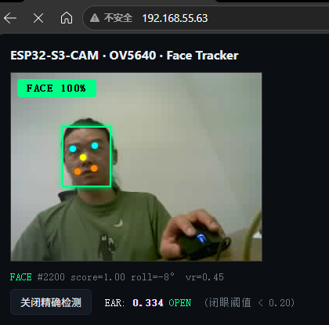

# ESP32-S3-CAM-Tracker

> **项目基线文档（迭代基准）**
> 基于 **ESP32-S3-CAM (Type-C / USB-OTG, N16R8)** + **OV5640 500 万像素摄像头** 的
> **人脸识别与追踪** 工程。集成 **WiFi 配网 / MJPEG 网页视频 / ESP-DL 人脸检测 / 双轴云台**。
>
> 本文档以「基线 + 变更记录」形式维护，作为后续每次迭代的更新依据。

---

## 1. 硬件

| 组件 | 型号 | 说明 |
|---|---|---|
| MCU | ESP32-S3 (N16R8) | 双核 240MHz + WiFi/BLE + AI 指令 |
| Flash | 16MB QIO | 分区表见 [partitions.csv](file:///e:/ESP32-S3-CAM-Tracker/partitions.csv) |
| PSRAM | 8MB Octal | 摄像头 fb / ESP-DL 张量 |
| 摄像头 | **OV5640 5MP**（15cm FPC） | DVP 8-bit + SCCB，与 OV2640 引脚兼容 |
| 舵机 | 2×SG90/MG90 | X / Y 轴云台 |
| USB | **Type-C 原生 USB-OTG**（无 UART 桥） | 使用 USB-CDC 打印 / 烧录 |

**供电**：OV5640 峰值电流可达 300mA，请用 **≥1A 电源**，否则会花屏。

---

## 2. 软件框架

- **构建**：PlatformIO + ESP-IDF v5.1（自动通过 `idf_component.yml` 拉取依赖）
- **依赖组件**：
  - `espressif/esp32-camera` — 摄像头驱动
  - `espressif/esp-dl` — 深度学习推理框架
  - `espressif/human_face_detect` — 人脸检测模型
- **配置**：[sdkconfig.defaults](file:///e:/ESP32-S3-CAM-Tracker/sdkconfig.defaults) 已启用 USB-CDC、Octal PSRAM 80MHz、优化编译。

---

## 3. 目录结构

```
ESP32-S3-CAM-Tracker/
├── CMakeLists.txt                # 顶层 ESP-IDF 工程
├── platformio.ini                # PlatformIO + espidf 环境
├── sdkconfig.defaults            # 默认 sdkconfig（PSRAM/USB-CDC/WiFi）
├── partitions.csv                # 4M app + 2M spiffs
├── main/
│   ├── CMakeLists.txt            # 组件注册 + 嵌入 HTML
│   ├── idf_component.yml         # 依赖清单
│   ├── include/
│   │   ├── camera_pins.h         # 摄像头/舵机 GPIO（依据原理图）
│   │   ├── app_camera.h
│   │   ├── app_wifi.h            # WiFi + 凭据管理接口
│   │   ├── app_httpd.h
│   │   ├── app_gimbal.h
│   │   └── app_face_detect.h
│   ├── main.c                    # 启动主流程
│   ├── app_camera.c              # OV5640 初始化 / 抓帧
│   ├── app_wifi.c                # STA/AP 切换 + NVS 存储
│   ├── app_httpd.c               # 视频推流 + 配网 REST
│   ├── app_gimbal.c              # LEDC PWM + PID
│   ├── app_face_detect.cpp       # ESP-DL 检测任务
│   └── web/
│       ├── index.html            # 主页（视频 + 人脸框）
│       └── wifi.html             # 配网页面
└── 淘宝客服提供的ESP32-S3-CAM开发板资料/  # 原厂资料
```

---

## 4. 运行架构

```
      ┌──────────┐  JPEG  ┌──────────────────┐  RGB565  ┌────────────┐
      │  OV5640  ├───────►│  face_detect 任务 ├─────────►│ ESP-DL     │
      │  (DVP)   │        │  (core 1)         │          │ HumanFace  │
      └──────────┘        └──┬───────────┬────┘          └──────┬─────┘
      QVGA 320x240           │           │                      │
                             │           │ face_result_t        │
                             │           │ (box+5kp+pose+ear)   ▼
                             ▼           ▼                ┌─────────────┐
                        ┌─────────┐ ┌─────────┐          │ app_gimbal  │
                        │/capture │ │  /face  │          │ (LEDC PWM)  │
                        │ (帧推送) │ │ (JSON)  │          └─────────────┘
                        └────┬────┘ └─────────┘
                             │
                    ┌────────┴────────────────────┐
                    ▼                             ▼
              路线A (ESP32端)               路线C (浏览器端)
              img.src 轮询 ~5fps            MediaPipe 468点
              绿色人脸框 + 5关键点          EAR 精确闭眼检测
              青色眼/黄色鼻/橙色嘴          (需客户端互联网)
```

- **推流**：前端用 `img.src='/capture'` 自驱动轮询（onload → 下一帧），不使用 `/stream` MJPEG 长连接（避免 httpd 单线程阻塞导致 `/face` 超时）。
- **检测**：`face_detect` 任务独立按 100~200ms 节奏抓帧，JPEG→RGB565 后送入 `HumanFaceDetect::run()`，输出人脸框 + 5 点关键点。
- **前端**：`/face` JSON 轮询叠加绿色框 + 彩色关键点；可选启用 MediaPipe 在浏览器端做 468 点精确 EAR 闭眼检测。

---

## 5. Web 页面 & REST API

| 路径 | 方法 | 说明 |
|---|---|---|
| `/`             | GET  | 主页：视频画面 + 人脸框 + 5点关键点 + 闭眼检测 |
| `/stream`       | GET  | `multipart/x-mixed-replace` MJPEG 推流（保留，默认不使用） |
| `/capture`      | GET  | 单帧 JPEG（附带 `X-Face` 响应头含检测结果） |
| `/face`         | GET  | 最新检测结果 JSON `{valid,x,y,w,h,score,frame,iw,ih,kp[10],roll,vr,drowsy}` |
| `/wifi`         | GET  | **配网页面**（扫描/输入/保存） |
| `/wifi/status`  | GET  | `{mode:"STA/AP", saved_ssid, configured}` |
| `/wifi/scan`    | GET  | 附近 AP 列表 `[{ssid,rssi,auth}]` |
| `/wifi/save`    | POST | body `ssid=..&pass=..` 保存并重启 |
| `/wifi/reset`   | POST | 清除凭据并重启，进入 AP 配网 |

---

## 6. WiFi 配置管理

**启动策略**（[app_wifi.c](file:///e:/ESP32-S3-CAM-Tracker/main/app_wifi.c)）：

```
                有凭据？
              /         \
            Yes          No
            │             │
       STA 连接         直接进 AP
     (最多 6 次重试)         │
      成功？                 │
     /     \                 │
   Yes     No ────────► 降级为 AP
    │
    正常运行
```

**AP 模式**（首次上电 / STA 失败）：
- SSID：`ESP32-CAM-<mac 末4位>`
- 密码：`12345678`
- IP：`192.168.4.1`
- 用手机连接后浏览器打开 `http://192.168.4.1/wifi`，选择/输入家庭 WiFi 保存即可。

**凭据存储**：NVS 命名空间 `wifi_cfg`，键 `ssid` / `pass`。

**清除配置**：
- 网页：`/wifi` 页面「清除配置」按钮
- REST：`curl -X POST http://<ip>/wifi/reset`
- 命令行：`pio run -t erase`（会同时擦除 Flash 全部数据）

---

## 7. 快速开始

### 7.1 使用快捷脚本（推荐）

工程内置了跨平台的一键开发脚本，位于 [scripts/](file:///e:/ESP32-S3-CAM-Tracker/scripts)。

**Windows (PowerShell / CMD)：**

```powershell
# 环境自检（PlatformIO / 串口）
.\scripts\dev.ps1 check

# 只编译
.\scripts\dev.ps1 build

# 编译 + 下载 + 打开串口（一步到位；BOOT+RST 手动进入下载模式后执行）
.\scripts\dev.ps1 upload -Port COM6

# 全流程：clean → build → flash → monitor
.\scripts\dev.ps1 all -Port COM6

# 全片擦除（会清除 WiFi 配置）
.\scripts\dev.ps1 erase -Port COM6
```

CMD 用户直接双击或运行：`scripts\dev.bat check` / `scripts\flash-and-run.bat`（后者一键 upload+monitor，可通过 `set PORT=COM6` 指定端口）。

**MacOS / Linux (Bash)：**

```bash
# 首次赋予执行权限
chmod +x scripts/dev.sh

# 环境自检
./scripts/dev.sh check

# 只编译
./scripts/dev.sh build

# 编译 + 下载 + 打开串口
./scripts/dev.sh upload --port /dev/ttyACM0     # Linux (native USB-CDC)
./scripts/dev.sh upload --port /dev/tty.usbmodem14101   # MacOS

# 全流程：clean → build → flash → monitor
./scripts/dev.sh all --port /dev/ttyACM0

# 全片擦除
./scripts/dev.sh erase --port /dev/ttyACM0
```

**支持的子命令**（Windows/Mac/Linux 一致）：`check` `build` `flash` `monitor` `upload` `erase` `clean` `fullclean` `size` `all` `reset` `help`。

脚本会自动检测 `pio` / `platformio` / `python -m platformio`，无需手动切换。

### 7.2 原生 PlatformIO 命令

```bash
# 1. 编译（首次会拉取 esp-dl / human_face_detect，需 5~15 分钟）
pio run

# 2. 手动进入下载模式：按住 BOOT -> 短按 RST -> 松开 BOOT
pio run -t upload

# 3. 打开串口监视
pio device monitor
```

> **典型串口/COM 端口**
> - Windows：`COM3` ~ `COM20`（USB-CDC 设备 VID/PID = `303A:4001`）
> - MacOS ：`/dev/tty.usbmodem*` 或 `/dev/cu.usbmodem*`
> - Linux ：`/dev/ttyACM0`（原生 USB-CDC）或 `/dev/ttyUSB0`
>
> Linux 首次使用请把用户加入 `dialout` 组：`sudo usermod -aG dialout $USER`（重登生效）。

**首次上电**：
```
=== ESP32-S3-CAM Face Tracker ===
sensor PID=0x5640 (0x5640=OV5640, 0x2640=OV2640)
no wifi cred saved, enter AP for provisioning
 AP MODE (WiFi 配网)
 SSID    : ESP32-CAM-A4F8
 PASSWORD: 12345678
 Config  : http://192.168.4.1/wifi
```

手机连上该 AP → 浏览器打开 `http://192.168.4.1/wifi` → 选择你的家庭 WiFi → 保存。

**再次上电**（已配网）：
```
try STA connect: MyHomeWiFi
sta got IP: 192.168.1.123
STA -> http://192.168.1.123/
```

浏览器打开 `http://192.168.1.123/` 即可看到视频与人脸框。

---

## 8. 关键调整点

| 需求 | 位置 |
|---|---|
| 摄像头引脚 | [camera_pins.h](file:///e:/ESP32-S3-CAM-Tracker/main/include/camera_pins.h) |
| 检测分辨率 / 帧率 | [main.c](file:///e:/ESP32-S3-CAM-Tracker/main/main.c) 中 `DET_FRAMESIZE` |
| 云台方向 / PID | [app_gimbal.c](file:///e:/ESP32-S3-CAM-Tracker/main/app_gimbal.c) |
| AP 密码 / 超时 | [app_wifi.c](file:///e:/ESP32-S3-CAM-Tracker/main/app_wifi.c) 顶部宏 |
| 页面样式 | [main/web/index.html](file:///e:/ESP32-S3-CAM-Tracker/main/web/index.html) / [wifi.html](file:///e:/ESP32-S3-CAM-Tracker/main/web/wifi.html) |
| 替换检测模型 | [app_face_detect.cpp](file:///e:/ESP32-S3-CAM-Tracker/main/app_face_detect.cpp) 中 `HumanFaceDetect` 换为 `PedestrianDetect` 等 |

---

## 9. 常见问题

| 现象 | 排查 |
|---|---|
| PC 无 COM 口 | 用**数据线**；按住 BOOT → 短按 RST → 松开 BOOT 进入下载模式 |
| `sensor PID=0x0000` / init 失败 | FPC 排线反向、供电不足（改 1A 电源）、引脚配置错误 |
| 视频卡顿 / 掉线 | `DET_FRAMESIZE` 改为 `FRAMESIZE_QVGA`；确认路由器 2.4GHz |
| 页面 404 wifi.html | 未 embed，检查 [main/CMakeLists.txt](file:///e:/ESP32-S3-CAM-Tracker/main/CMakeLists.txt) `EMBED_FILES` |
| STA 连不上 | 检查 2.4G / 无中文 SSID / 加密方式；`/wifi/reset` 后重配 |
| `human_face_detect.hpp not found` | `pio pkg install` 强制拉组件 |

---

## 10. 迭代路线图（Roadmap）

- [x] **v0.1** ESP-IDF 骨架，OV5640 初始化，LEDC 云台
- [x] **v0.2** WiFi STA + MJPEG 推流 + 主页
- [x] **v0.3** ESP-DL HumanFaceDetect + 前端人脸框
- [x] **v0.4** **WiFi 配置管理**（NVS 存储 / AP 配网 / REST API）
- [x] **v0.5** **跨平台快捷脚本**（Windows PowerShell/CMD + MacOS/Linux Bash）
- [x] **v0.6** **升级到 ESP-IDF 5.5.5 + ESP-DL 3.0**（pioarduino fork）
- [x] **v0.7** **配网体验优化** (Captive Portal / UI 自动扫描)
- [x] **v0.8** **配网 UX 全面升级** (AP 常在 / mDNS / 状态面板 / 引导页)
- [x] **v0.9** **人脸检测全链路修复 + 5点关键点 + 闭眼检测** ← **当前版本**
- [ ] **v1.0** OTA 空中升级（`esp_https_ota`）
- [ ] **v1.1** SD 卡录像 + MPU-6050 稳像
- [ ] **v1.2** MQTT 上报检测结果 / 云端管理
- [ ] **v1.3** 多目标 ByteTrack 追踪 + 目标 ID 保持

---

## 11. 变更日志

### v0.9 (current) — 人脸检测全链路修复 + 5点关键点 + 闭眼检测

**核心改动**：修复了人脸检测从"不工作"到"score=1.00 + 5点关键点 + 双路闭眼检测"的完整链路。

#### 1. ESP-DL 检测调优（根因修复）

- **MSR/MNP 双阈值配置** [app_face_detect.cpp](file:///e:/ESP32-S3-CAM-Tracker/main/app_face_detect.cpp#L60-L64)
  - 问题：MSR int8 量化后原始分数 <0.5，被默认阈值全部过滤 → 检测不到任何人脸
  - 修复：`det->set_score_thr(0.05, 0)` 放宽 MSR；`det->set_score_thr(0.5, 1)` 收紧 MNP
  - 效果：score 从 0 提升到 0.98~1.00
- **检测分辨率匹配** [main.c](file:///e:/ESP32-S3-CAM-Tracker/main/main.c#L50-L51)
  - QVGA 320×240 (4:3) 与 MSR 模型输入 160×120 宽高比完全匹配，避免缩放失真
- **摄像头 AE 预热** [app_face_detect.cpp](file:///e:/ESP32-S3-CAM-Tracker/main/app_face_detect.cpp#L74-L79)
  - OV5640 启动后丢弃前 12 帧让自动曝光收敛，避免暗帧漏检
- **检测任务延迟调整** [app_face_detect.cpp](file:///e:/ESP32-S3-CAM-Tracker/main/app_face_detect.cpp#L148-L150)
  - 命中时 100ms / 丢失时 200ms，减少与 stream 的帧缓冲竞争

#### 2. 推流架构重构（解决 httpd 阻塞）

- **问题**：ESP-IDF httpd 单线程，`stream_handler` 的 `while(1)` 推流阻塞了 `/face` 的 AJAX 请求 → 前端永远显示"搜索中…"
- **修复**：前端从 `` 改为 `img.src='/capture'` 自驱动轮询
  - `capture_handler` 发完一帧即返回，不阻塞 httpd 线程
  - `X-Face` 响应头附带人脸数据，一个请求同时拿到帧+检测结果
  - `/face` API 独立轮询叠加检测框和关键点

#### 3. 5 点关键点 + 粗略疲劳检测（路线 A）

- **face_result_t 扩展** [app_httpd.h](file:///e:/ESP32-S3-CAM-Tracker/main/include/app_httpd.h)
  - 新增：`kp[10]`（5点×2坐标）、`roll`（头部倾斜角）、`vert_ratio`（眼鼻嘴比例）、`drowsy`（疲劳标志）
- **MNP 关键点读取** [app_face_detect.cpp](file:///e:/ESP32-S3-CAM-Tracker/main/app_face_detect.cpp#L128-L152)
  - 5点顺序：`[0]左眼 [1]左嘴角 [2]鼻尖 [3]右眼 [4]右嘴角`（原图绝对坐标）
  - 计算 roll = 双眼连线与水平线夹角
  - 计算 vert_ratio = 眼→鼻 / 眼→嘴 垂直比例（低头时下降）
  - drowsy 判定：`vert_ratio < 0.35` 或 `|roll| > 25°`
- **前端可视化** [index.html](file:///e:/ESP32-S3-CAM-Tracker/main/web/index.html)
  - 5 个彩色圆点：青色=眼睛 / 黄色=鼻尖 / 橙色=嘴角
  - 疲劳预警横幅（红色闪烁动画）

#### 4. MediaPipe 468 点精确闭眼检测（路线 C）



- **按需加载**：前端按钮点击后从 CDN 加载 MediaPipe FaceLandmarker（~11MB，需客户端互联网）
- **EAR 计算**：标准 6 点 Eye Aspect Ratio 算法
  - 左眼点：33, 160, 158, 133, 153, 144
  - 右眼点：362, 385, 387, 263, 373, 380
  - `EAR < 0.20` → CLOSED，否则 OPEN
- **GPU 加速**：`delegate: 'GPU'`，单帧推理 15-40ms
- **触发机制**：`img.onload` → `window.dispatchEvent('frameReady')` → MediaPipe `detect()`

#### 5. TF 卡支持（部分）

- SDMMC 1-bit 模式（CLK=39 / CMD=38 / D0=40）硬件通信已成功
- 128GB SDXC 卡需格式化为 FAT32（ESP32 默认不支持 exFAT）

**新增/修改文件**

| 文件 | 改动 |
|------|------|
| [app_face_detect.cpp](file:///e:/ESP32-S3-CAM-Tracker/main/app_face_detect.cpp) | MSR/MNP 阈值、预热、keypoint 读取、姿态计算 |
| [app_httpd.c](file:///e:/ESP32-S3-CAM-Tracker/main/app_httpd.c) | capture_handler 改为直接取帧+X-Face头、face_handler 增加 kp/roll/drowsy |
| [app_httpd.h](file:///e:/ESP32-S3-CAM-Tracker/main/include/app_httpd.h) | face_result_t 扩展字段 |
| [main.c](file:///e:/ESP32-S3-CAM-Tracker/main/main.c) | DET_FRAMESIZE → QVGA |
| [index.html](file:///e:/ESP32-S3-CAM-Tracker/main/web/index.html) | /capture 轮询 + 5点可视化 + 疲劳预警 + MediaPipe EAR |

**性能指标**

| 指标 | 值 |
|------|-----|
| 人脸检测 score | 0.98 ~ 1.00 |
| 检测帧率 | ~4.5 fps |
| 视频帧延迟 | avg 52ms / max 112ms |
| /capture + X-Face | 27/27 成功（含人脸数据） |
| Flash | 17.4% (2.91MB / 16MB) |
| RAM | 21.5% (70KB / 320KB) |

**踩坑记录**

- **MJPEG stream 阻塞 httpd**：ESP-IDF httpd 是单线程的，`stream_handler` 的 `while(1)` 无限推流循环会饿死所有其他 URI handler。双 httpd 实例方案（端口 80+81）因 LWIP socket 限制失败。最终改为 `/capture` 短轮询 + `X-Face` 头方案。
- **blob URL 渲染问题**：`fetch + blob URL + revokeObjectURL` 在快速轮询时图片来不及渲染就被撤销，改用浏览器原生 `img.src` 直接刷新。
- **DET_FRAMESIZE 未持久化**：HVGA (480×320, 3:2) 与 MSR 模型 (160×120, 4:3) 宽高比不匹配导致缩放失真，改为 QVGA (320×240, 4:3)。
- **MSR int8 量化分数偏低**：MSR 阶段原始分数 <0.5 但 MNP 精调后可达 1.0，这是量化精度损失的正常现象，通过放宽 MSR 阈值解决。

### v0.8 — 配网 UX 全面升级

**核心改动**：把配网过程从"技术活"变成"填个 SSID 点保存"。

- **AP 始终广播（APSTA 常开模式）** [app_wifi.c#L144-L172](file:///e:/ESP32-S3-CAM-Tracker/main/app_wifi.c#L144-L172)
  - 之前：有 NVS 凭据时进入 STA 模式，AP 消失 → 用户手机连不上、无法重新配网
  - 现在：`WIFI_MODE_APSTA` 常开，AP `ESP32-CAM-xxxx` **始终**广播
  - STA 连接失败也不影响 AP，彻底解决"AP 消失"痛点
  - 事件处理器加入模式判断：AP-only 场景下不响应 `STA_START/DISCONNECTED`，避免空凭据自动重连日志洪流
- **mDNS 服务** [main.c#L29-L47](file:///e:/ESP32-S3-CAM-Tracker/main/main.c#L29-L47) + [idf_component.yml](file:///e:/ESP32-S3-CAM-Tracker/main/idf_component.yml)
  - 新增依赖 `espressif/mdns@^1.8.0`（实测拉取到 1.11.3）
  - STA 已连接时注册 `esp32-cam-<MAC 后 4 位>.local` 和 `esp32-cam.local`
  - 用户浏览器直接访问 `http://esp32-cam.local/` 观看视频流，**无需查 IP**
- **`/wifi/status` API 扩展** [app_httpd.c#L155-L200](file:///e:/ESP32-S3-CAM-Tracker/main/app_httpd.c#L155-L200)
  - 返回字段：`mode / saved_ssid / configured / sta_connected / sta_ip / ap_ip / mac / hostname`
  - 前端据此实时展示"视频地址"直达链接
- **`/wifi/save` 改造为异步重启** [app_httpd.c#L260-L308](file:///e:/ESP32-S3-CAM-Tracker/main/app_httpd.c#L260-L308)
  - 之前：`sendstr("OK...")` 后立即 `esp_restart()`，TCP 响应可能被打断
  - 现在：先返回 `{"ok":true,"ssid":"...","mac":"...","reboot_in_ms":2000}`，再由独立任务延迟 2s 重启
  - 前端有完整时间渲染下一步指引页
- **配网页 UI 升级** [wifi.html](file:///e:/ESP32-S3-CAM-Tracker/main/web/wifi.html)
  - 顶部状态条实时显示："模式 / 已连 SSID / 视频地址（IP + mDNS 双链接）"
  - 保存成功后**整页替换为操作指引**：
    1. 推荐：手机切回目标 WiFi → 点 `http://esp32-cam-xxxx.local/` 直达视频
    2. 备用：路由器 DHCP 表按 MAC 查 / 用 Fing 扫描
    3. 失败回退：AP 永远在线，可随时 `192.168.4.1/wifi` 重配
  - 加入 2 秒倒计时提示"连接中断属正常现象"
- **`/wifi/scan` 修复真正根因** [app_httpd.c#L202-L228](file:///e:/ESP32-S3-CAM-Tracker/main/app_httpd.c#L202-L228)
  - 前一版报错 `SyntaxError: Unexpected token 'S', "Server has..."` 的根源：`esp_wifi_scan_start` 在 `WIFI_MODE_AP` 下返回 `ESP_ERR_WIFI_MODE (0x3005)`，且默认扫描耗时 >5s 触发 httpd 默认超时（响应体 "Server has encountered an unexpected error"）
  - 修复：① 改用 APSTA 让 STA 接口可扫描 ② 缩短 `scan_time.active.max=120ms`（13 信道 ~1.5s） ③ 加长 `recv/send_wait_timeout=30s` ④ 500 分支改返回合法 JSON `{"error":"scan_failed","code":"..."}` 便于前端定位
- **Captive Portal 覆盖 STA 场景** [main.c#L82-L84](file:///e:/ESP32-S3-CAM-Tracker/main/main.c#L82-L84)
  - AP 始终在线，所以 DNS 劫持 + 404 → `/wifi` 也一直开启（仅影响 AP 侧客户端）

**新增/修改文件**
- [main/app_wifi.c](file:///e:/ESP32-S3-CAM-Tracker/main/app_wifi.c)：`start_ap_and_sta()` 取代 `start_ap()`，`app_wifi_start()` 重写
- [main/app_httpd.c](file:///e:/ESP32-S3-CAM-Tracker/main/app_httpd.c)：`wifi_status_handler`、`wifi_save_handler`、`wifi_scan_handler`、`delayed_restart_task`、`app_httpd_start` 全部调整
- [main/main.c](file:///e:/ESP32-S3-CAM-Tracker/main/main.c)：新增 `start_mdns()`
- [main/idf_component.yml](file:///e:/ESP32-S3-CAM-Tracker/main/idf_component.yml)：加入 `espressif/mdns`
- [main/web/wifi.html](file:///e:/ESP32-S3-CAM-Tracker/main/web/wifi.html)：`loadStatus / scan / pick / save / showConnectHint` 全部重写
- [scripts/snap_log.py](file:///e:/ESP32-S3-CAM-Tracker/scripts/snap_log.py)：加入 `--reset` 参数触发硬复位后抓 COM 日志

**踩坑记录**
- **NVS 残留导致 AP 消失**：修改前的旧固件在 STA fallback 到 AP 期间有 15s 空窗，若中途 assert 会永远停在 STA 尝试；解决办法 `esptool erase-region 0x9000 0x6000` 清空 NVS
- **烧录地址写错**：曾误在 `0x9000` 写入 `partitions.bin`（本应 `0x8000`）覆盖 NVS 结构，导致启动异常；养成用固定脚本的习惯
- **Windows `netsh wlan show networks` 缓存滞后**：AP 已广播但扫描结果延迟 15-30s，需要 `mode=bssid` 参数或多次重试
- **pio "Couldn't find target config" 假失败**：ninja 编译其实成功了但 pio 输出解析报错，`ls .pio/build/esp32s3cam/*.bin` 可发现 `esp32s3cam_tracker.bin` 已生成，手动 `Copy-Item ... firmware.bin` 后可直接 esptool 烧录

**Flash / RAM**
- Flash: `2792896 bytes` / 4 MB app 分区 = 66.6%（较 v0.7 增加 ~45KB，来自 mdns 组件）
- RAM: 17.8%（未变）

**用户操作流程（v0.8）**
1. 首次上电 → 手机连 `ESP32-CAM-xxxx`（密码 `12345678`）→ 系统自动弹出配网页
2. 从自动扫描列表点选家用 WiFi → 输入密码 → 保存
3. 引导页告知视频地址（推荐 `http://esp32-cam.local/`）
4. 手机 WiFi 切回家用 → 浏览器打开该链接观看视频
5. 若失败，AP 永远在线，可随时回到步骤 1 重来（无需 esptool、无需按键）

### v0.7
- **配网体验优化 (Captive Portal)**：
  - **DNS 劫持**：AP 模式下劫持所有 DNS 请求，强制返回 `192.168.4.1`。
  - **HTTP 自动重定向**：捕获所有未匹配的 HTTP 请求（如 iOS/Android 的探测 URL），通过 302 重定向到 `/wifi` 配网页面。
  - **效果**：手机连接 `ESP32-CAM-xxxx` 热点后，系统会自动弹出配网浏览器窗口，无需手动输入 IP 地址。
- **WiFi 配置页 (`wifi.html`) 升级**：
  - **自动扫描**：页面加载后自动扫描并展示附近 WiFi 列表，按信号强度排序。
  - **点击填入**：点击列表中的任何一项，其 SSID 会被自动填入输入框。
  - **开放网络处理**：如果所选 WiFi 为开放网络（无密码），密码输入框会自动禁用。
- **修复 pio `uv` 编译超时**：解决了因 `esptoolpy` 未在正确的 IDF venv 中安装，导致 PlatformIO 每次编译都尝试重装并超时的历史遗留问题。

### v0.6
- **平台切换**：`platformio.ini` 由官方 `espressif32@6.7.0`（IDF 5.2.1，社区最高只到 5.2）切换到 [pioarduino/platform-espressif32](https://github.com/pioarduino/platform-espressif32) `55.03.311`（内置 **ESP-IDF 5.5.5**、xtensa-esp-elf 14.2、esptool 5.3.0）
- **ESP-DL 升级 2.0 → 3.0**：`idf_component.yml` 依赖 `espressif/esp-dl: ^3.0.0` + `espressif/human_face_detect: ^0.5.0`
- **代码适配 ESP-DL 3.0 新 API**：
  - 使用 `dl::image::img_t{data,width,height,pix_type=DL_IMAGE_PIX_TYPE_RGB565LE}` 替代旧 tensor 输入
  - `HumanFaceDetect::run(img)` 返回 `std::list<dl::detect::result_t>`，`result.box[4]` 为 `x0,y0,x1,y1`
- **兼容 IDF 5.5 breaking changes**：
  - [app_wifi.c](file:///e:/ESP32-S3-CAM-Tracker/main/app_wifi.c) 添加 `#include "esp_mac.h"`（`MACSTR/esp_read_mac/ESP_MAC_WIFI_SOFTAP` 从 esp_system.h 移出）
  - [app_gimbal.c](file:///e:/ESP32-S3-CAM-Tracker/main/app_gimbal.c) `LEDC_TIMER_16_BIT` → `LEDC_TIMER_14_BIT`（IDF 5.5 移除 16 位，S3 LEDC LS 硬件最高 14 位）
  - [app_gimbal.h](file:///e:/ESP32-S3-CAM-Tracker/main/include/app_gimbal.h) 补 `#include <stdbool.h>`
- 编译产物：Flash 16.4% (2.75MB / 16MB)，RAM 17.8% (58KB / 320KB)

### v0.5
- 新增 [scripts/dev.ps1](file:///e:/ESP32-S3-CAM-Tracker/scripts/dev.ps1)：Windows PowerShell 一键脚本（check/build/flash/monitor/upload/erase/clean/fullclean/size/all/reset）
- 新增 [scripts/dev.bat](file:///e:/ESP32-S3-CAM-Tracker/scripts/dev.bat) + [scripts/flash-and-run.bat](file:///e:/ESP32-S3-CAM-Tracker/scripts/flash-and-run.bat)：CMD 包装 / 一键 upload+monitor
- 新增 [scripts/dev.sh](file:///e:/ESP32-S3-CAM-Tracker/scripts/dev.sh)：MacOS / Linux Bash 一键脚本（子命令与 Windows 完全对齐）
- 脚本自动检测 `pio` / `platformio` / `python -m platformio`，无需手动切换
- README「快速开始」章节按 Windows / MacOS / Linux 分别列出用法

### v0.4
- 新增 `app_wifi.c/h`：NVS 凭据存储、STA/AP 自动切换、`app_wifi_apply_and_reboot()`
- HTTP：新增 `/wifi`、`/wifi/status`、`/wifi/scan`、`/wifi/save`、`/wifi/reset`
- 前端：新增 [wifi.html](file:///e:/ESP32-S3-CAM-Tracker/main/web/wifi.html)（扫描/输入/保存/清除），主页加入配网入口
- `main.c` 移除硬编码 SSID，改用 `app_wifi_start()`

### v0.3
- 引入 ESP-DL `HumanFaceDetect`，检测任务 core 1 独立运行
- JPEG 共享缓冲机制避免 fb 争抢

### v0.2
- MJPEG `/stream`、`/capture`、`/face` API 建立
- 主页 HTML 前端叠加人脸框

### v0.1
- ESP-IDF 骨架 + `esp32-camera` + LEDC 双轴云台
